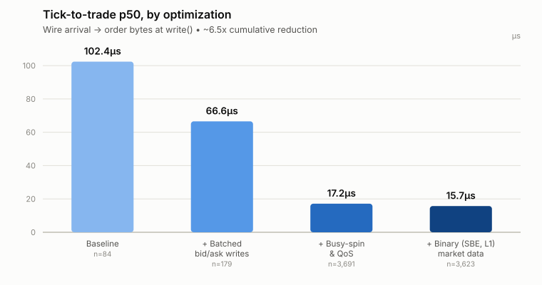
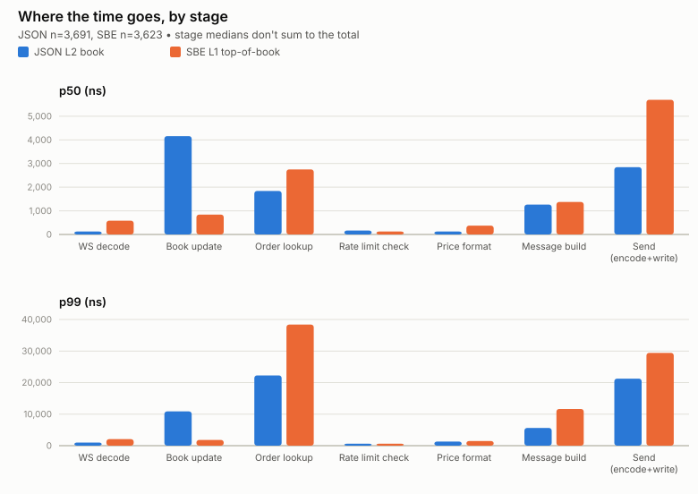

# C++ Low-Latency Trading Engine

Low-latency spot trading engine for OKX V5 in C++20.

The engine maintains a live L2 order book from an incremental WebSocket feed, runs a
strategy against it, and manages the full order lifecycle — placement, fills, cancellation,
and reconciliation across reconnects, with pre-trade risk limits and a kill switch. It
places, amends and cancels orders over an authenticated WebSocket session, reconciles local
state against the exchange on every reconnect, and halts via a kill switch on a
realised-loss breach.

## Contents

- [Architecture](#architecture)
- [Design](#design)
- [Benchmarks](#benchmarks)
- [Requirements](#requirements)
- [Build](#build)
- [Configuration](#configuration)
- [License](#license)

## Architecture

```
  OKX public WS ─┐
                 ├─ Asio reactor ─ TLS ─ RFC 6455 codec ─ parser ─ order book
  OKX private WS ┘                                           │
                                                             │
                                                             ▼
                                                         strategy
                                                             │
                                             risk checks ────┤
                                                             ▼
                                        order manager ─ WS / REST ─ OKX

  └─ everything from the reactor to the order manager runs on one busy-spinning thread
  └─ log calls go through an SPSC ring to a writer thread, then stdout
```

## Design

In pipeline order (see *Architecture* above):

- **WebSocket framing (RFC 6455)**: the handshake, frame decoding, and masking are
  implemented from the spec. Continuation frames are reassembled into a single
  fixed-capacity buffer that's reused across messages with no reallocation.
- **Receive buffering with in-place parsing**: a purpose-built scanner parses messages directly
  off the receive buffer instead of being copied into a DOM or other intermediate
  representation first.
- **Binary market data (SBE L1)**: a handwritten decoder reads fields at
  fixed byte offsets straight off the wire.
- **Incremental order book (JSON L2)**: a custom order book sequences updates via
  `seqId`/`prevSeqId` and holds them in pre-allocated, fixed-capacity storage.
- **Slabs, ring buffers, SPSC queue**: reactor, parsing, strategy, risk, and order management
  run on one busy-spinning thread. A fixed-capacity ring buffer batches outbound WebSocket
  writes, with every buffer pre-allocated so nothing touches the heap.
- **Order lifecycle, reconciliation, risk**: orders live in a fixed-capacity, slab-allocated
  store and are tracked through a state machine that's reconciled against exchange state on
  every reconnect. Pre-trade checks run before any order placement, and a kill switch cancels
  everything and halts on a realised-loss breach.
- **Per-endpoint rate limiting**: a custom sliding-window limiter checks each endpoint against
  OKX's WS trade-endpoint limits.
- **Measurement**: latency is tracked with its own TSC-timestamped, cycle-accurate histogram
  implementation staged through the whole pipeline.
- **Async logging**: log writes go through a lock-free SPSC ring, synchronised with
  `std::atomic` and explicit C++ memory-model ordering.

A few design choices worth calling out:

- **Asio's scope**: Asio only handles readiness and TLS (`asio::ip::tcp::socket`,
  `asio::ssl::stream`). Framing and message assembly aren't handed off to a library.
- **Buffer ownership**: receive buffers belong to the engine rather than Asio, so messages get
  parsed straight off the read buffer instead of being copied into something else first.
- **Using libraries for some infrastructure**: Boost.Asio provides the reactor loop, OpenSSL
  handles TLS/HMAC-SHA256/base64, and libcurl handles the REST cold path.

## Benchmarks

Benchmarking targets p50 and p99 tick-to-trade latency, measured on an Apple Silicon laptop
rather than dedicated server hardware. Tick-to-trade is defined as wire arrival (socket read
return) to the encoded order/amend bytes being queued for the socket write.



| Configuration                    | p50      | p99     | n     |
|----------------------------------|----------|---------|-------|
| Baseline                         | 102.4 µs | —       | 84    |
| + Batched bid/ask into one write | 66.6 µs  | —       | 179   |
| + Busy-spin event loop + QoS     | 17.2 µs  | 41.5 µs | 3,691 |
| + SBE L1 market data             | 15.7 µs  | 56.8 µs | 3,623 |

p99 is only reported once `n` is large enough for the percentile to be statistically
significant (roughly 2,000+ samples). Three changes got p50 numbers down by ~6.5x:

- **Batched writes**: bid and ask amend requests go out in one socket `write()` instead of two
  separate calls, so the second no longer queues behind the first's still-in-flight send.
- **Busy-spin + QoS**: keeping the event loop thread from ever voluntarily descheduling.
- **SBE market data**: replacing JSON L2 book parsing with OKX's binary SBE L1 feed.

### Reverted optimisations

There were some changes that looked promising but did not hold up under measurement:

- **Single-pass JSON field scan**: collapsed four separate scans of the book-update payload
  (`seqId`, `prevSeqId`, `bids`, `asks`) into one. This was verified to be faster in
  isolation, but there was no measurable change end-to-end, as OKX's payload sizes (a few
  hundred bytes) were too small to make scanning the bottleneck.
- **Custom JSON key search and fixed-decimal parser**: written to replace
  `std::format`/`strtod`. 3.5-7x faster per call in an isolated microbenchmark, but there
  were no measurable tick-to-trade differences.
- **Darwin real-time scheduling policy** (`THREAD_TIME_CONSTRAINT_POLICY`): this was stacked
  on top of the busy-spin loop but no measurable effect was detected.
- **Logger writer thread pinned to background QoS**: no measurable impact was seen.

### Stage-by-stage breakdown



| Stage               | JSON L2 p50 | JSON L2 p99 | SBE L1 p50 | SBE L1 p99 |
|---------------------|-------------|-------------|------------|------------|
| WS decode           | 125 ns      | 1,007 ns    | 583 ns     | 2,079 ns   |
| Book update         | 4,159 ns    | 10,879 ns   | 839 ns     | 1,823 ns   |
| Order lookup        | 1,839 ns    | 22,271 ns   | 2,751 ns   | 38,399 ns  |
| Rate limit check    | 167 ns      | 631 ns      | 125 ns     | 631 ns     |
| Price format        | 125 ns      | 1,295 ns    | 375 ns     | 1,471 ns   |
| Message build       | 1,263 ns    | 5,631 ns    | 1,375 ns   | 11,647 ns  |
| Send (encode+write) | 2,847 ns    | 21,247 ns   | 5,695 ns   | 29,439 ns  |

A few things worth noting about this table:

- **L1 vs L2**: JSON L2 maintains a full 32-level order book per side while SBE only tracks
  the L1 best bid/offer, so `Book update` being cheaper on SBE reflects both the smaller
  workload to update the order book and faster deserialisation.
- **Stage boundaries**: `perf::ReadCounter()` checkpoints are threaded through the pipeline,
  so each stage gets its own histogram rather than one combined statistic. This is why stage
  percentiles don't sum to the total's.

## Requirements

Developed on a macOS (Apple Silicon) with the following prerequisites:

- macOS 14+, arm64, Xcode Command Line Tools (Apple clang 17+ / C++20)
- CMake 3.20+, Ninja
- OpenSSL 3, Boost
- System `libcurl`

## Build

```sh
cmake --preset release   # or: debug, asan
cmake --build --preset release
```

Formatting is enforced by a pre-commit hook. `core.hooksPath` is per-clone config, so enable
it once after cloning:

```sh
git config core.hooksPath .githooks
```

The hook rejects commits whose staged C++ files aren't clang-format clean.

- `cmake --build <dir> --target format` fixes the whole tree.
- `cmake --build <dir> --target format-check` reports without rewriting.

## Configuration

Add credentials as environmental variables.

```sh
export OKX_API_KEY=...
export OKX_API_SECRET=...
export OKX_PASSPHRASE=...
export OKX_MARKET_DATA_MODE=json   # or: sbe
```

## License

MIT.
